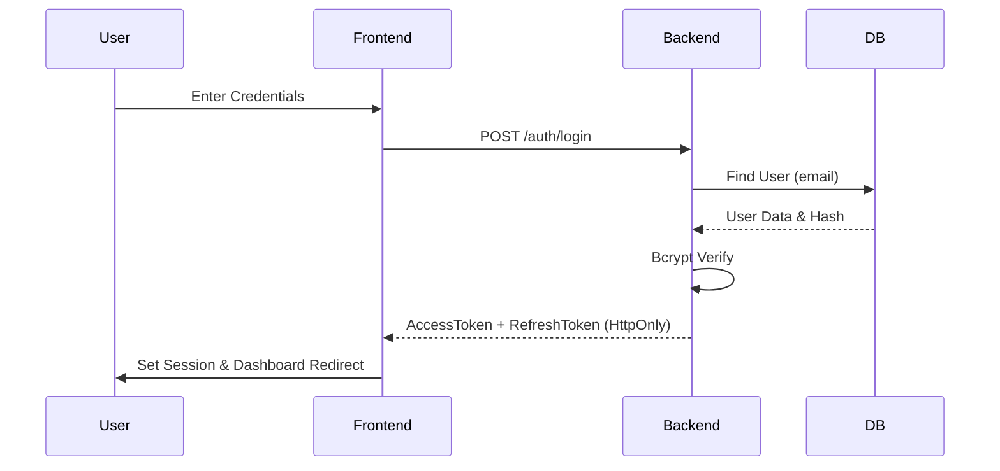
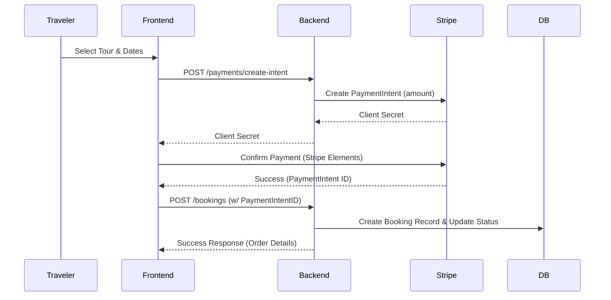

# 🎨 LocalGems Frontend - Elite Experience

<div align="center">


[](https://localgem-l-frontend-bx4r.vercel.app/)
[](https://www.typescriptlang.org/)
[](https://reactjs.org/)
[](https://tailwindcss.com/)

**Production-grade, high-performance UI/UX for the ultimate tour discovery marketplace.**

</div>

---

## 📖 **Overview**

LocalGems Frontend is a state-of-the-art **Next.js 14 application** featuring premium glassmorphism design, advanced Framer Motion animations, and robust state management via RTK Query. Designed for speed, accessibility, and visual excellence.

### **🌟 Highlights**

- ✨ **Elite UI/UX** with 3D scale and shimmer hover effects
- 🌙 **Seamless Dark Mode** with zero-flicker transitions
- ⚡ **Optimized Performance** with Next.js App Router & Image optimization
- 🔐 **Secure RBAC** with Protected Routes and JWT session handling
- 🧱 **Atomic Architecture** with reusable premium UI components
- 📱 **Mobile First** responsive layout for all form factors

---

# LocalGems - Production SaaS Tour Booking Platform

> **Status**: Production Ready (v1.0.0)  
> **Documentation Version**: 2.1 - Enterprise Edition

---

## 1. Executive Summary

### Product Name
**LocalGems** (Tour Booking Platform)

### SaaS Category
Two-sided Marketplace (Traveler ↔ Local Guide)

### Business Problem Statement
Traditional travel agencies offer generic, overpriced, and impersonal tours. Travelers crave authentic, local usage, but independent guides lack the tools to market themselves, manage bookings, and process secure payments effectively. This disconnect creates a market gap for a platform that bridges trust, discovery, and transaction.

### Solution Overview
LocalGems is a comprehensive Tour Booking SaaS that empowers local experts to list unique experiences and allows travelers to book them seamlessly. It provides a full suite of tools: booking management, secure payments, real-time messaging, and review systems.

### Target Market
- **Travelers**: Solo backpackers, couples, and small groups seeking authentic experiences.
- **Micro-Entrepreneurs**: Local guides, historians, and foodies wanting to monetize their knowledge.

### Key Value Propositions
1.  **Trust & Safety**: Verified guides and secure payment processing (Stripe).
2.  **Seamless UX**: "Zero-friction" booking flow with instant confirmation.
3.  **Local Empowerment**: Democratic platform allowing anyone to become a guide.
4.  **Scalable Tech**: Built on a modern, high-performance stack (Next.js 14, Node.js).

---

## 2. Product Overview

### Platform Description
LocalGems is a role-based web application accessible via desktop, tablet, and mobile browsers. It functions as a complete ecosystem for the tour industry.

### Core User Roles
1.  **Tourist (Traveler)**: Browses tours, makes bookings, writes reviews, and manages wishlists.
2.  **Guide (Provider)**: Creates tour listings, manages schedule/availability, views earnings, and communicates with guests.
3.  **Admin (Platform Owner)**: Oversees users, approves/rejects guides, monitors platform activity, and manages system settings.

### Supported Platforms
- **Web**: Fully responsive PWA-ready web application.
- **Mobile**: Optimized for iOS/Android mobile browsers.

---

## 3. Technology Stack

### Frontend
- **Framework**: React 19 (Next.js 14 App Router) - TypeScript
- **State Management**: Redux Toolkit + RTK Query (Caching & Sync)
- **Styling**: Tailwind CSS v4 + Framer Motion (Animations)
- **Components**: Lucide React (Icons), Radix UI (Primitives)
- **Forms**: React Hook Form + Zod Validation
- **Utilities**: Date-fns, CLSX

### Backend
- **Runtime**: Node.js (v20 LTS)
- **Framework**: Express.js (v5)
- **Database**: PostgreSQL (via Supabase/Neon) + Prisma ORM
- **Authentication**: JWT (Access/Refresh Tokens) + BCrypt Hashing
- **Security**: Helmet, Rate-Limit, CORS, XSS Sanitzation

### Infrastructure
- **Hosting**: Vercel (Frontend), Render/Railway (Backend)
- **CI/CD**: GitHub Actions (Automated Linting & Build)
- **Storage**: Supabase Storage / AWS S3 (Images)

---

## 4. System Architecture

### High-Level Architecture
LocalGems follows a **Client-Server Architecture**. The Next.js frontend serves as the presentation layer, communicating with the Express.js backend via a RESTful API.

#### 🔐 Authentication Flow


#### 💳 Payment & Booking Flow


### Data Flow
1.  **User Action**: User submits a booking request.
2.  **Frontend**: Validates input (Zod), dispatches RTK Query mutation.
3.  **API Gateway**: Express middleware validates JWT & Rate Limits.
4.  **Controller**: Calls Service layer to process booking logic.
5.  **Database**: Prisma transaction updates Booking & Guide Schedule tables.
6.  **Response**: Updated state returned to Frontend; UI optimistic update.

---

## 5. Environment Configuration

### Development
- `NODE_ENV=development`
- Local Database (Docker/Localhost Postgres)
- Mock Stripe Payments

### Production
- `NODE_ENV=production`
- Cloud Database (Supabase/Neon)
- Live Stripe Webhooks
- Strict CORS & Security Headers

---

## 6. Public Website Pages

| Page Name | URL | Description |
|-----------|-----|-------------|
| **Home** | `/` | Hero, Curated Experiences, Testimonials, CTA |
| **Explore** | `/explore` | Search, Filtering, Map View of Tours |
| **Tour Details** | `/tours/[id]` | Images, Itinerary, Reviews, Booking Form |
| **About Us** | `/about` | Company mission & team |
| **Contact** | `/contact` | Inquiry form (Validated) |
| **FAQ** | `/faq` | Searchable questions |
| **Membership** | `/membership` | Pro tier information |

---

## 7. Authentication & Authorization

### Flow
1.  **Registration**: Users select role (Tourist/Guide) during sign-up.
2.  **Login**: Returns `accessToken` (short-lived) and `refreshToken` (httpOnly cookie).
3.  **Persistence**: `RTK Query` generic `baseQuery` handles automatic token refresh on 401.
4.  **RBAC**: Higher-order components (`ProtectedRoute`) block access to unauthorized pages (e.g., Guide accessing Admin Dashboard).

---

## 8. Tourist Module Documentation

- **Discovery**: Advanced search by City, Date, Price, and Category.
- **Booking**: 3-step checkout (Guests -> Payment -> Confirmation).
- **Dashboard**:
  - **My Trips**: Upcoming vs Past bookings.
  - **Wishlist**: Saved favorite tours.
  - **Passport**: Virtual stamps for visited cities.
- **Profile**: Avatar upload, password reset, bio update.

---

## 9. Guide Module Documentation

- **Tour Management**: CRUD operations for Tours (Create, Edit, Delete).
- **Schedule**: Toggle specific dates or date ranges as available/unavailable.
- **Dashboard**:
  - **Earnings**: Chart view of daily/monthly revenue.
  - **Requests**: Accept/Decline pending bookings.
  - **Reviews**: Reply to guest feedback.

---

## 10. Admin Module Documentation

- **User Management**: Search users, Block/Suspend accounts.
- **Content Moderation**: Approve newly created tours before they go public.
- **Analytics**: Platform-wide GMV (Gross Merchandise Value), Total Users.
- **System Health**: Error logs and API latency metrics.

---

## 11. URLs & Live Links

| Service | Live URL | Repository |
|---------|----------|------------|
| **Frontend** | [Vercel Deployment](https://localgem-l-frontend-bx4r.vercel.app) | [GitHub Repo](https://github.com/rak9b/localgem_l_frontend) |
| **Backend** | [Render API](https://localgem-l-backend-3.onrender.com) | [GitHub Repo](https://github.com/rak9b/localgem_l_backend) |
| **API Base** | `https://localgem-l-backend-3.onrender.com/api/v1` | - |

---

## 12. Frontend Documentation

### Folder Structure
```bash
src/
├── app/                  # Next.js App Router (File-based routing)
│   ├── (auth)/           # Authentication layouts & groups
│   ├── dashboard/        # Role-based dashboards (Admin, Guide, Tourist)
│   ├── explore/          # Search & Filtering page
│   ├── tours/            # Tour details [id] dynamic routes
│   └── messages/         # Socket.io chat interface
├── components/           # UI Component Library
│   ├── layout/           # Shared components (Navbar, Footer, Sidebar)
│   ├── home/             # Homepage-specific components
│   ├── tours/            # Tour cards, filters, and details widgets
│   ├── chat/             # ChatBot and message components
│   └── ui/               # Primary UI primitives (Buttons, Modals, Inputs)
├── redux/                # Redux Toolkit State Management
│   ├── api/              # RTK Query API slices (baseApi, tourApi, etc.)
│   └── features/         # Slices for local state (Auth, Theme)
├── context/              # React Context (Theme, Custom hooks)
├── hooks/                # Custom React hooks (useAuth, useLocalStorage)
├── lib/                  # Library utilities (Socket.client, CLSX)
├── types/                # Global TypeScript interfaces & types
├── data/                 # Static data & Mock fallbacks
└── styles/               # Global CSS & Tailwind configuration
```

### State Management
- **Server State**: RTK Query (Auto-caching, invalidation tags).
- **Global UI State**: Redux Toolkit (Modals, User Session).
- **Local State**: `useState` (Form inputs, Toggles).

---

## 13. Backend Documentation

### Folder Structure
```
src/
├── app/
│   ├── modules/     # Feature-based (Auth, Tour, Booking)
│   ├── middlewares/ # Auth, Error, Validation
│   ├── routes/      # Index router
│   └── utils/       # Helpers
└── server.ts        # Entry point
```

### Error Handling
- **Global Error Handler**: Catches all async errors.
- **AppError Class**: Operational errors (400, 404, 401) vs Programming errors (500).

---

## 14. API Documentation Summary

### Auth
- `POST /auth/login` - Authenticate user
- `POST /auth/register` - Create account
- `POST /auth/refresh-token` - Get new access token

### Tours
- `GET /tours` - List all tours (Filters)
- `GET /tours/:id` - Get tour details
- `POST /tours` - Create tour (Guide/Admin)

### Bookings
- `POST /bookings` - Create booking
- `GET /bookings/my-bookings` - Get user's bookings

---

## 15. Database Documentation

- **Type**: Relational (PostgreSQL)
- **ORM**: Prisma
- **Key Models**:
  - `User` (1-n) `Booking`
  - `User` (1-n) `Tour` (as Guide)
  - `Tour` (1-n) `Review`
  - `Tour` (1-n) `Booking`

---

## 16. Credentials (Testing Only)

> **Warning**: Do not use these in production environment.

| Role | Email | Password |
|------|-------|----------|
| **Admin** | `admin@localgems.com` | `123456` |
| **Guide** | `guide@localgems.com` | `123456` |
| **Tourist** | `tourist@localgems.com` | `123456` |

---

## 17. UI/UX & Performance

- **Lighthouse Score**: Target 90+ across all metrics.
- **Accessibility**: ARIA labels, semantic HTML, keyboard navigation.
- **Loading**: React Suspense + Custom Skeleton Loaders.
- **Feedback**: Hot Toast notifications for success/error states.

---

## 18. Security Practices

- **Sanitization**: Zod validates all API inputs.
- **Encryption**: Passwords hashed with Bcrypt (Salt 12).
- **Secrets**: Environment variables (`.env`) for keys.
- **HTTP**: Secure Cookies for Refresh Tokens (HttpOnly).

---

## 19. Deployment & DevOps

1.  **Commit**: Code pushed to `main` branch.
2.  **Lint**: GitHub Action runs ESLint & TypeCheck.
3.  **Build**: Next.js builds optimization.
4.  **Deploy**: Vercel/Render deploys new immutable instance.

---

## 20. Known Limitations

- **Search**: Currently strict text matching (no fuzzy search yet).
- **Payment**: Currently Mock/Stripe Test Mode only.
- **Socket**: Websocket scaling needs Redis adapter for multi-instance.

---

## 21. Future Enhancements

- **Mobile App**: React Native version.
- **Currency**: Multi-currency support.
- **AI**: Recommended tours based on user history.
- **Languages**: i18n Internationalization.

---

## 22. Handover & Maintenance

### Project Ownership
- **Owner**: Client Name / Organization
- **Developer**: rakib Team

### Maintenance
- **Logs**: Monitor Vercel/Render logs weekly.
- **Updates**: Keep `npm` packages updated quarterly.
- **Database**: Weekly backups (Automated by Provider).

---

## Appendix

- **Glossary**:
  - **GMV**: Gross Merchandise Value (Total bookings amount).
  - **PAX**: Number of passengers/guests.

> **LocalGems** - Authenticity in every journey.  
> *Documentation generated by rakib.*