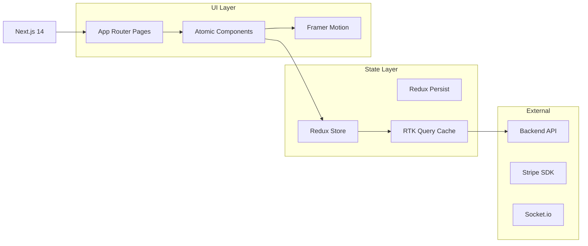

# 🎨 LocalGems Frontend - Elite Experience

<div align="center">


[](https://localgem-l-frontend-bx4r.vercel.app/)
[](https://www.typescriptlang.org/)
[](https://reactjs.org/)
[](https://tailwindcss.com/)

**Production-grade, high-performance UI/UX for the ultimate tour discovery marketplace.**

[Live Demo](https://localgem-l-frontend-bx4r.vercel.app/) • [Features](#2-features) • [Stack](#4-technology-stack) • [Setup](#5-installation--setup) • [Architecture](#3-architecture)

</div>

---

## 1. Project Overview

LocalGems Frontend is a state-of-the-art **Next.js 14 application** designed to deliver a premium, seamless experience for travelers and local guides. It features ultra-modern glassmorphism, advanced animations, and a robust state management system to handle complex Marketplace interactions.

---

## 2. Features

### 🏠 **Public Experience**
- **Dynamic Hero**: High-fidelity visuals with 3D scale effects.
- **Advanced Explore**: Real-time filtering by city, category, and price range.
- **Tour Details**: Interactive galleries and itinerary step-throughs.
- **Multi-Currency**: Instant switching between global currencies (USD, EUR, etc).

### 🔐 **Authentication**
- **JWT Session Handling**: Token storage with refresh logic.
- **Protected Routes**: Custom guards for role-based navigation.
- **Persistence**: Session state maintained via Redux Persist.

### 👤 **Role Dashboards**
- **Tourist**: Passport system, Wishlist, and simplified Booking management.
- **Guide**: Visualized Earnings charts, Tour Listing editor, and Booking moderation.
- **Admin**: Platform-wide user management and statistical overview.

---

## 3. Architecture

### **Frontend Logic Flow**


---

## 4. Technology Stack

- **Core**: Next.js 14 (App Router)
- **State**: Redux Toolkit & RTK Query
- **Styling**: Tailwind CSS v4 (Glassmorphism tokens)
- **Motion**: Framer Motion
- **Validation**: Zod + React Hook Form
- **Icons**: Lucide React

---

## 5. Installation & Setup

### **Prerequisites**
- Node.js 20+
- `pnpm`, `npm` or `yarn`

### **Setup**
```bash
# Install
npm install

# Environment
# Copy .env.example -> .env
# VITE_API_URL=https://your-api.com/api/v1

# Run
npm run dev
```

---

## 6. Project Structure

```bash
src/
├── app/          # File-based Routing
├── components/   # UI Library (ui, home, layout, tours)
├── redux/        # Global State & API Slices
├── hooks/        # Custom React Hooks
└── types/        # TypeScript Interfaces
```

---

## 7. Authentication & Authorization

- **Client Guard**: `ProtectedRoute` component intercepts restricted routes.
- **Token**: Bearer token injected into every RTK Query header.
- **Persistence**: Encrypted storage in `localStorage`.

---

## 8. API Documentation (Client)

- **baseApi**: Centralized configuration for all server interactions.
- **tourApi**: Hooks for discovery and listing management.
- **authApi**: Methods for login, registration, and profile fetching.

---

## 9. Usage Instructions

### **Running Locally**
1. Ensure Backend is running.
2. Run `npm run dev`.
3. Visit `http://localhost:3000`.

---

## 10. Deployment Guide

- **Platform**: Vercel.
- **Build Command**: `npm run build`.
- **Requirements**: Set `NEXT_PUBLIC_API_URL` in Vercel settings.

---

## 11. Development Guidelines

- **Atomic Design**: Keep components small and reusable.
- **Style Standard**: Use Tailwind utility classes; avoid custom CSS where possible.
- **Testing**: Run `npm run lint` before committing.

---

## 12. Security Considerations

- **XSS Protection**: React handles injection safety; sanitization for user input.
- **Auth Tokens**: Rotated on regular intervals via refresh tokens.
- **Env Hygiene**: Strictly Git-ignored `.env` files.

---

## 13. Contribution Guidelines

1. Follow the [Root Contribution Guide](../README.md#13-contribution-guidelines).
2. Ensure types are defined for all new properties.

---

## 14. License

Licensed under **MIT**.

---

## 15. Roadmap

- [ ] **Dark Mode optimization**: Full accessibility audit.
- [ ] **PWA Integration**: Offline tour viewing capability.
- [ ] **Internationalization**: Support for multiple languages.

---

## 16. Support & Contact

- **Discord**: [Join Chat](#)
- **Issues**: [FE Track](https://github.com/rak9b/localgem_l_frontend/issues)

---

<div align="center">

**Built with ❤️ and Modern Tech by rakib Team**

</div>